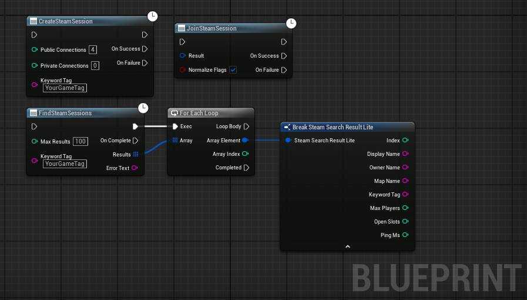

# UE5.5-SteamSessionHelper

Blueprint-friendly fix for Steam hosting/joining issues in Unreal Engine 5.5.  
This plugin wraps the Steam Online Subsystem (OSS) with async Blueprint nodes and applies fixes for common UE5.5 Steam SDK session problems that affect indie developers.

---

## 🚀 Quick Start
1. Enable **Online Subsystem Steam**, **Steam Shared Module**, and **Steam Sockets** in Unreal.  
2. Restart the editor.  
3. Add an empty C++ class (to allow plugins to compile).  
4. Close the editor.  
5. Drop `SteamSessionHelper/` into your project’s `Plugins/` folder.  
6. Copy everything from [`Docs/DefaultEngine_SteamConfig.txt`](Docs/DefaultEngine_SteamConfig.txt) into your project’s `Config/DefaultEngine.ini`.  
7. Reopen Unreal, build, and enable **Steam Session Helper** in Edit → Plugins.  

---

## ✨ Features
- Create Steam Sessions (properly configured for Steam presence + lobbies)  
- Find Steam Sessions (returns clean results with map, owner, slots, ping, keyword tag)  
- Join Steam Sessions (with automatic flag normalization to fix UE5.5 join failures)  
- Async Blueprint Nodes (OnSuccess / OnFailure pins, no C++ required)  
- Indie developer–friendly: works out of the box without modifying engine code  

---

## ⚙️ Requirements
Enable these Unreal plugins (**Edit → Plugins → Online**):  
- Online Subsystem Steam  
- Steam Shared Module  
- Steam Sockets  

---

## 📦 Installation
- Enable required plugins (above)  
- Restart Unreal  
- Convert to C++ Project (add an empty C++ class)  
- Close Unreal  
- Add Plugin → drop `SteamSessionHelper/` into your project’s `Plugins/` folder  
- Configure Steam: copy everything from [`Docs/DefaultEngine_SteamConfig.txt`](Docs/DefaultEngine_SteamConfig.txt) into `Config/DefaultEngine.ini`  
- Reopen project and compile  

---

## 🎮 Usage
Blueprint nodes (category: **Steam | Session**):  
- **Create Steam Session**  
- **Find Steam Sessions**  
- **Join Steam Session**  

Example:  
  

---

## 🔧 Technical Fixes
- Applies correct default session settings on host:  
  - bUsesPresence = true  
  - bUseLobbiesIfAvailable = true  
  - bShouldAdvertise = true  
  - bAllowJoinInProgress = true  
  - Adds `SEARCHKEYWORDS` tag for filtering  

- Adds **NormalizeFlags** option in `JoinSteamSession` to fix UE5.5 join mismatches  

- Returns structured results in `FindSteamSessions`:  
  - DisplayName (Owner — Map [Keyword])  
  - OwnerName  
  - MapName  
  - KeywordTag  
  - MaxPlayers / OpenSlots  
  - PingMs  

---

## ❓ Why This Plugin?
Unreal Engine 5.5 introduced quirks in **OnlineSubsystemSteam** that break multiplayer workflow:  
- `JoinSession()` often fails due to mismatched lobby/presence flags  
- Sessions advertise but aren’t visible without extra settings  
- `FindSessions()` gives incomplete or unusable results  
- Blueprint-only projects cannot easily work around these issues  

👉 This plugin fixes those problems and restores a reliable Steam multiplayer workflow.  

---

## 📄 License
This project is licensed under the **MIT License**.  
You are free to use it in commercial and non-commercial projects, with attribution.
